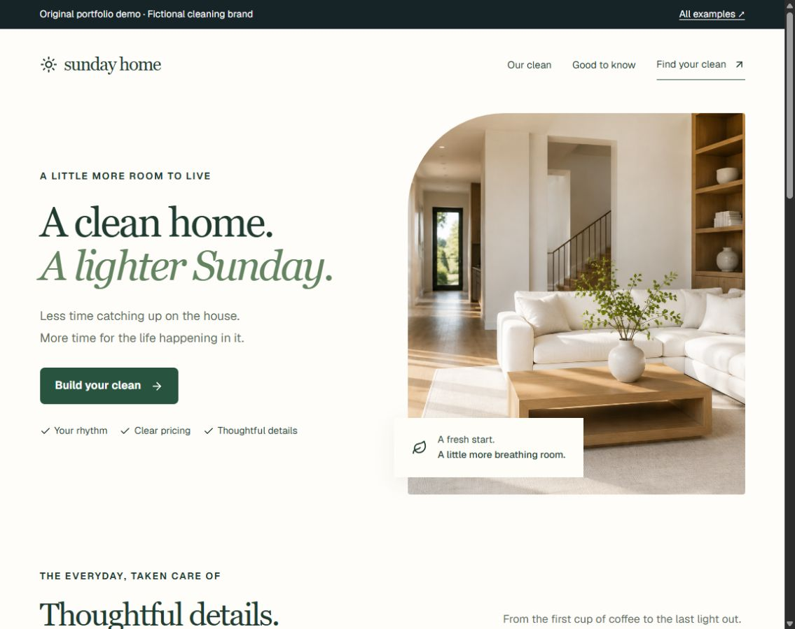

# Four working React interfaces

Original interactive portfolio demonstrations by Pierce O'Donnell: a service website, reporting dashboard, guided project brief and CSV review tool. Open a live example, inspect its implementation, or run the complete app locally.

[Live portfolio](https://pierce-portfolio-demos.odonnelltradingco.chatgpt.site) · [Automatic checks](https://github.com/odonnelltradingco-svg/portfolio-work-samples/actions/workflows/verify-samples.yml) · [Discuss a project on Upwork](https://www.upwork.com/freelancers/~01fb4a3dd2fdc715be)



## Choose a workflow

| Example | Try it | Start in the code |
| --- | --- | --- |
| **Sunday Home** — cleaning-service website | [Compare home sizes, visit plans and itemized prices](https://pierce-portfolio-demos.odonnelltradingco.chatgpt.site/home-care) | [React page](app/home-care/page.tsx), [pricing model](lib/demo-model.ts), [pricing tests](tests/clean-estimate.test.mjs) |
| **Fieldnote** — sales dashboard | [Combine filters, inspect a record and export the current view](https://pierce-portfolio-demos.odonnelltradingco.chatgpt.site/insights) | [React page](app/insights/page.tsx), [filtering and totals](lib/demo-model.ts), [behavior tests](tests/portfolio-flows.test.mjs) |
| **Scope Studio** — project brief | [Choose a scope, validate the details and export a brief](https://pierce-portfolio-demos.odonnelltradingco.chatgpt.site/project-quote) | [React page](app/project-quote/page.tsx), [validation and estimate](lib/demo-model.ts) |
| **Orderly** — CSV review | [Review accepted and exception rows without uploading the file](https://pierce-portfolio-demos.odonnelltradingco.chatgpt.site/data-cleanup) | [React page](app/data-cleanup/page.tsx), [parser and cleanup](lib/order-cleanup.ts), [edge-case tests](tests/order-cleanup.test.mjs) |

All demonstration brands, customer records and prices are fictional. The examples do not reserve appointments, submit leads or collect payment. O'Donnell OS is a separate original product, linked from the portfolio; its private product source is not in this package.

## Run locally

Use Node.js 22.13 or newer and pnpm 11.19. Run these commands from this `web-interfaces` folder:

```text
pnpm install --frozen-lockfile --ignore-scripts
pnpm test
pnpm typecheck
pnpm dev
```

Open the local URL printed by the development server. The app requires no environment variables, API keys, database or account access. Installation needs an internet connection; the font loader and external portfolio links also use the network. CSV data and form choices are processed in the browser and are not sent to a server.

For the production build:

```text
pnpm build
pnpm start
```

The source uses React 19, TypeScript, Next-style App Router files and the Vinext/Vite build runtime. It is not a claim that this snapshot was built with `next build`. Versions are recorded in `package.json` and `pnpm-lock.yaml`. The image shim's `ipaddr.js` dependency is explicit so the independent Node build can resolve it under pnpm's strict package layout.

## Decisions worth inspecting

- **Exact estimates.** Cleaning discounts are calculated in cents, so line items and displayed totals reconcile. The checks cover all 120 supported size/plan/add-on combinations, known prices and invalid selections.
- **One source for reporting.** The current filtered records drive table rows, collected revenue, chart buckets and CSV output. Pending and refunded records do not inflate paid totals.
- **Validation before progression.** The brief form identifies the field that needs attention. Duplicate optional features do not increase the price or delivery estimate.
- **Traceable cleanup.** Orderly preserves original values and explains rejected records. It checks file size, schema, dates, numeric bounds, duplicates and quoted CSV input. The browser and Python demonstrations are separate implementations with their own tests.
- **Deliberate interaction details.** Labeled controls, dialog focus return, reduced-motion styles, copy failure feedback and an export preview are part of the interface. Downloads retain their object URLs while the browser resolves them.
- **Small shared pieces.** `demo-shared.tsx` supplies consistent choices and navigation. `ExportPreview` handles the common copy/download interaction. Calculations stay in pure functions, outside the page components.

## What the automated checks cover

`pnpm test` runs 22 calculation, filtering, validation and CSV tests. `pnpm typecheck` checks the TypeScript source, and `pnpm build` compiles and prerenders the routes. The build also requires all five public pages to produce complete documents; a compiler exit alone cannot silently pass a skipped page. These checks do not automate a browser, prove accessibility conformance or certify every browser/device. The original portfolio's separately recorded browser checks are not rerun by this package.

## Source and dependencies

This package starts from the published portfolio snapshot recorded in [SOURCE-MAP.json](SOURCE-MAP.json). Application code, tests and public assets were copied from that project; formatting is normalized for reading, and build settings were adapted for independent local use. Private hosting identifiers and credentials are not required. The source map retains the original hashes before formatting; future live-site updates may differ from this snapshot.

The interface primitives in `components/ui` use [Base UI](https://base-ui.com/) and [shadcn/ui](https://ui.shadcn.com/), with Lucide icons and Tailwind styles. The shadcn license notice is included in [SHADCN-LICENSE.md](SHADCN-LICENSE.md). Installed third-party packages keep their own licenses.
